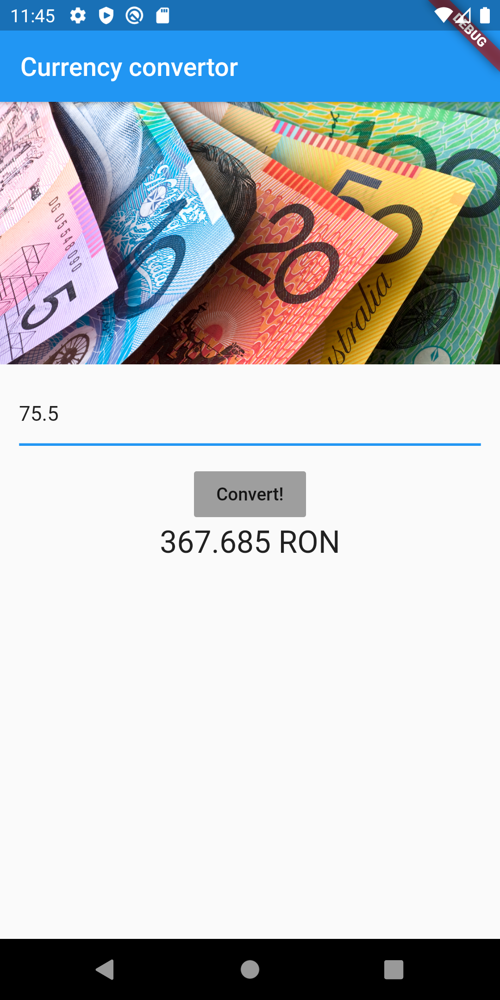
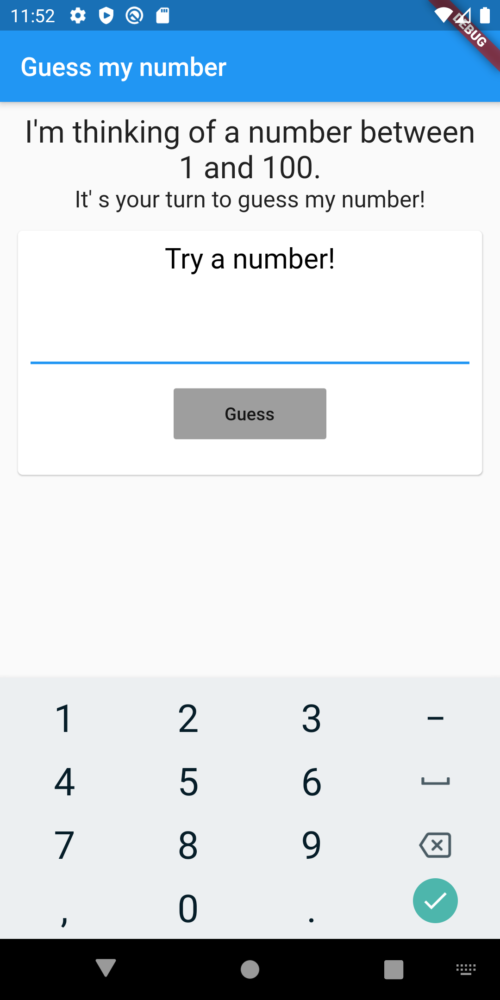
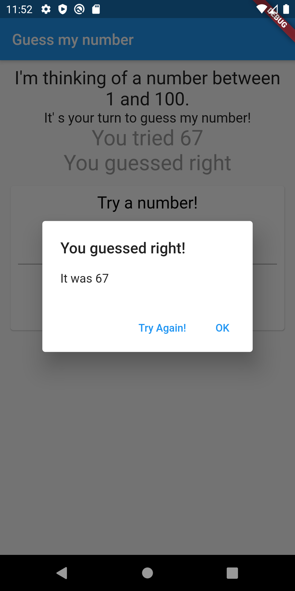
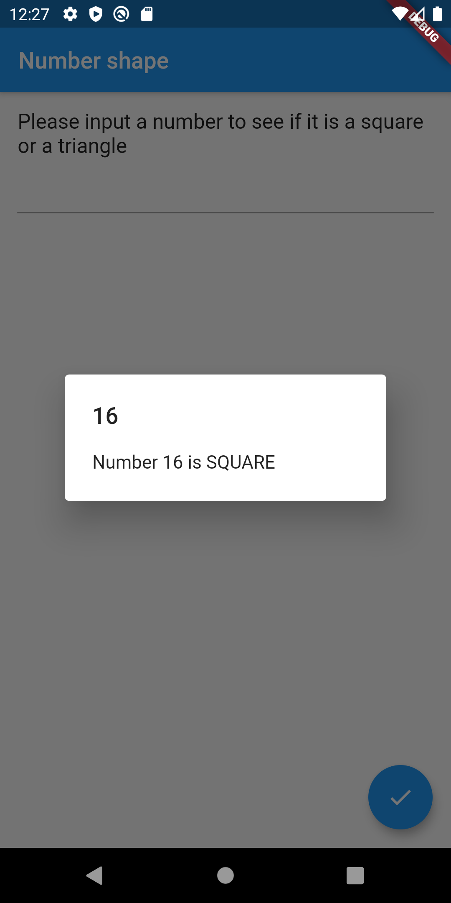
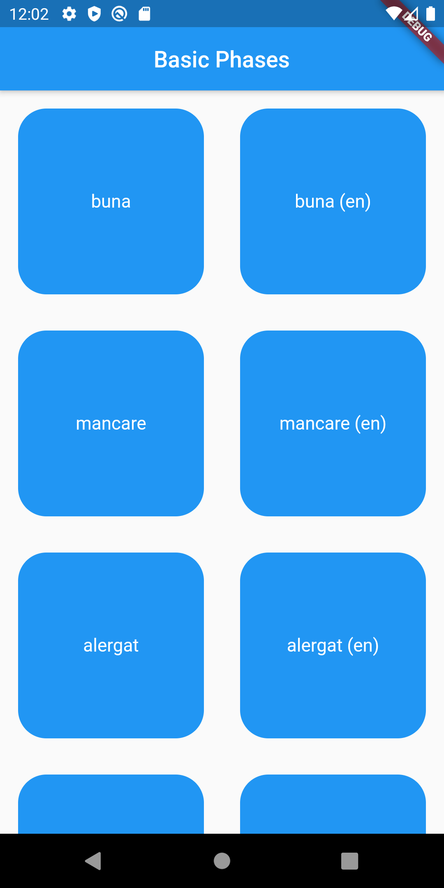
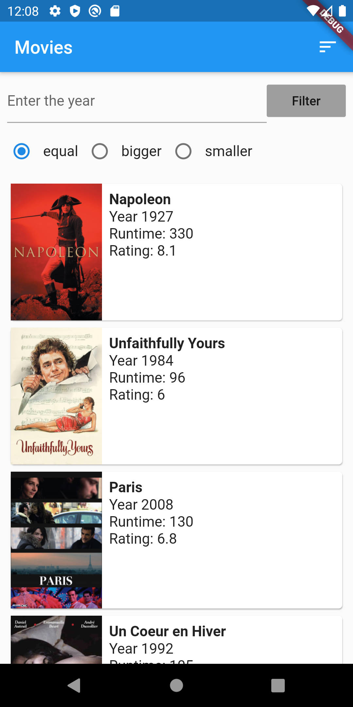

# Google Flutter Homework

This repo contains multiple Flutter applications, as follows: 
 
To test one application, clone the Github repo and edit in main.dart file the import using the package & app that you want to test.

## Currency converter

Convert a value from EURO to RON

## Guess my number

Try to guess random numbers 

## Number shaper

Check if a number is a square, a cube, both of them or neither one

## Basic phrases

Play audio text from a box 

## Tic tac toe

## Movies app 1

Display movies from an external API, with options for filtering and order by

## Movies app 2

Display movies from an external API, with Redux for state management and a more complex architecture

- Can be found on the package called homework567
